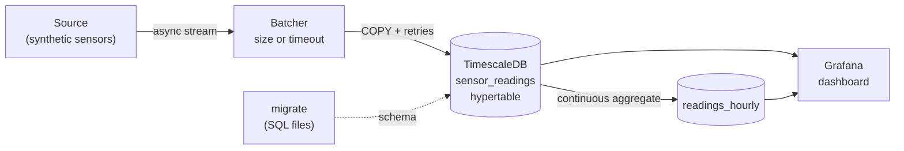

# data-pipeline-template

[](https://github.com/Oradixx/data-pipeline-template/actions/workflows/ci.yml)


A ready-to-run time-series stack: an **async Python ingestion service** streams data into
**TimescaleDB**, and **Grafana** shows it on a provisioned dashboard. One command starts
everything; swap the synthetic source for a real one and you have a pipeline.



## Quick start

Requires Docker and [uv](https://docs.astral.sh/uv/) (`brew install uv`).

```bash
make install   # venv, dependencies, git hooks, .env from .env.example
make up        # build and start db, migrate, ingest and grafana
make logs      # watch rows being written
```

Open **http://localhost:3000** (credentials in `.env`) → dashboard **Pipeline overview**.
`make down` stops everything (data kept), `make reset` also deletes the data.

## How it works

| Piece | What it does | Why this way |
|---|---|---|
| `sources.py` | Simulates engine telemetry (temperature, oil pressure, RPM) for N devices, with rare spikes. | Runs with zero external data. Any object with an async `stream(stop)` method can replace it. |
| `batching.py` | Groups readings; flushes when a batch is full **or** has waited `BATCH_MAX_WAIT_S`. | Row-by-row inserts are slow; size-only batching leaves quiet sources stale. The bounded queue slows the source down if the database lags (back-pressure). |
| `sink.py` | Writes each batch with PostgreSQL `COPY`, retrying network errors with exponential backoff. | `COPY` is Postgres's bulk-load path. Only transient errors are retried — a real bug fails loudly. |
| `ingest.py` | Connects (waiting for the DB if needed), runs source → batcher → sink, stops cleanly on `SIGTERM`. | `docker compose stop` flushes the last batch instead of losing it. |
| `migrate.py` + `db/migrations/` | Applies `V<n>__name.sql` files once, in order, and records them with a checksum. | Schema is versioned with the code; editing an applied migration is detected. |
| `V001` | `sensor_readings` hypertable (long format), columnstore settings, index. | Adding a metric needs no schema change; old chunks are compressed automatically. |
| `V002` | `readings_hourly` continuous aggregate, refreshed every 15 min, real-time enabled. | Dashboards over months read pre-computed hourly stats, not billions of raw rows. |
| `V003` | 90-day retention on raw data. | Storage stays bounded; history lives on in the hourly aggregate. |
| `grafana/` | Datasource and dashboard provisioned from files. | No manual clicking; dashboards are versioned in git. |

## Configuration

All settings are environment variables — see [`.env.example`](.env.example).

| Variable | Default | Meaning |
|---|---|---|
| `DATABASE_URL` | — | PostgreSQL connection string |
| `SOURCE_DEVICES` | `5` | Number of simulated devices |
| `SOURCE_INTERVAL_S` | `1.0` | Seconds between two ticks |
| `BATCH_SIZE` | `500` | Max rows per write |
| `BATCH_MAX_WAIT_S` | `2.0` | Max seconds a row waits before being written |

## Development

```text
make check             lint, type check, unit tests (no database needed)
make test-integration  end-to-end tests against the running database
make migrate / ingest  run the pipeline from your machine against `make up`'s database
make psql              SQL shell in the database
make help              every command
```

CI runs three jobs on every push: lint + types + unit tests, integration tests against a
TimescaleDB service container, and a full `docker compose up` that checks rows arrive and
the Grafana dashboard is provisioned.

### Adding a real source

1. Write a class with `async def stream(self, stop: asyncio.Event) -> AsyncIterator[Reading]`.
2. Build it in `ingest.py` instead of `SyntheticSensorSource`.
3. New columns or tables → add `db/migrations/V004__….sql` (never edit an applied one).

## Project structure

```text
.
├── db/migrations/          # versioned SQL, applied by `pipeline migrate`
├── grafana/
│   ├── provisioning/       # datasource + dashboard provider
│   └── dashboards/         # dashboards as JSON
├── src/pipeline/
│   ├── batching.py  cli.py  config.py  ingest.py
│   ├── migrate.py   models.py  sink.py  sources.py
├── tests/
│   ├── unit/               # no database
│   └── integration/        # real TimescaleDB
├── docker-compose.yml
├── Dockerfile
└── Makefile
```

## License

[MIT](LICENSE)
